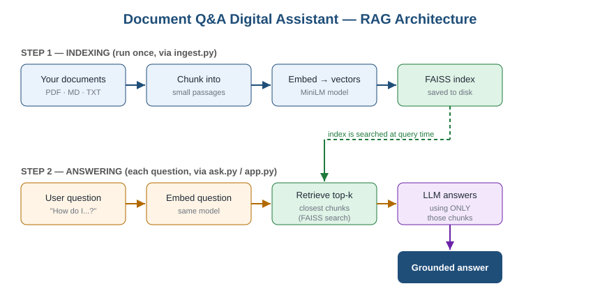

# 📚 Document Q&A Digital Assistant — Knowledge Management (RAG)

A digital assistant that answers questions about **your own documents**
(PDF, Markdown, or text). It uses **retrieval-augmented generation**: the app
first finds the most relevant passages in your files, then asks a language model
to answer using *only* those passages — so answers stay grounded and avoid
hallucination.

Built with Python, Sentence-Transformers, FAISS, and Streamlit.

---

## Why this project

General language models don't know your private manuals, policies, or notes.
RAG lets a chatbot answer questions about that material without retraining the
model — when the documents change, you just re-index them. This is the pattern
most companies use for internal Generative AI assistants.

---

## Setup

Requires Python 3.9+.

```bash
git clone https://github.com/Chandana18G/document-qa-digital-assistant.git
cd document-qa-digital-assistant
python -m venv .venv && source .venv/bin/activate   # Windows: .venv\Scripts\activate
pip install -r requirements.txt
```

The first run downloads the embedding model (~90 MB) and, if no OpenAI key is
set, `flan-t5-base` (~1 GB).

## Usage

1. **Add documents.** Put your `.pdf`, `.md` or `.txt` files in `documents/`
   (subfolders are fine). A `sample.md` is included so you can try it right away.
2. **Build the index.** Re-run this whenever your documents change:
   ```bash
   python ingest.py
   ```
3. **Ask questions** from the command line…
   ```bash
   python ask.py "How many days per week can I work remotely?"
   python ask.py          # interactive mode; empty line quits
   ```
   …or in the web chat:
   ```bash
   streamlit run app.py   # opens http://localhost:8501
   ```

### Configuration (environment variables)

| Variable | Default | Purpose |
|----------|---------|---------|
| `OPENAI_API_KEY` | *(unset)* | If set, answers are generated with `gpt-4o-mini`; otherwise the free local model is used. |
| `RAG_DOCS_DIR` | `./documents` | Folder to read documents from. |
| `RAG_INDEX_DIR` | `./index` | Folder where the vector index is stored. |

```bash
export OPENAI_API_KEY="sk-..."   # Windows PowerShell: $env:OPENAI_API_KEY="sk-..."
```

---

## How it works



```
                ┌─────────────────────────────────────────────┐
   documents/   │  1. INGEST   read PDF / MD / TXT files        │
  (your files)  │  2. CHUNK    split into ~500-char passages    │
        │       │  3. EMBED    turn each chunk into a vector     │
        ▼       │              (all-MiniLM-L6-v2)                │
   ┌─────────┐  │  4. STORE    save vectors in a FAISS index     │
   │ ingest  │──┼──────────────────────────────────────────────┘
   │  .py    │        writes -> index/
   └─────────┘
                ┌─────────────────────────────────────────────┐
   your         │  5. EMBED the question the same way           │
  question ────▶│  6. RETRIEVE the top-k closest chunks (FAISS) │
                │  7. GENERATE an answer from those chunks (LLM) │
                └─────────────────────────────────────────────┘
                                   │
                                   ▼
                       grounded answer + sources
```

- **Embedding model:** `all-MiniLM-L6-v2` (small, fast, free).
- **Vector search:** FAISS with cosine similarity.
- **Answer model:** OpenAI `gpt-4o-mini` if you set an API key, otherwise a free
  local `flan-t5-base` model — so it runs with **zero cost** out of the box.

## Project structure

| File | What it does |
|------|--------------|
| `rag.py` | Core engine: read, chunk, embed, retrieve, generate. |
| `ingest.py` | Builds the FAISS vector index from `documents/`. |
| `ask.py` | Command-line question answering. |
| `app.py` | Streamlit web chat interface. |
| `documents/` | Put your source files here (includes `sample.md`). |
| `architecture.svg` | Pipeline diagram. |
| `requirements.txt` | Python dependencies. |

---

## What I learned / demonstrated

- Building a full RAG pipeline end to end (chunking, embeddings, vector search,
  prompt construction, grounded generation).
- Using FAISS for fast semantic similarity search.
- Prompt engineering to constrain the model to the retrieved context and reduce
  hallucination.
- Designing the code so the LLM backend is swappable (cloud API or local model).

---

## Possible next steps

- Add citation highlighting (show which chunk each sentence came from).
- Swap FAISS for a hosted vector database (e.g. Chroma, Pinecone).
- Deploy the Streamlit app to the cloud.

---

*Built by Chandana Gurusiddappa — M.Sc. Data Science & AI.
[GitHub](https://github.com/Chandana18G) · [LinkedIn](https://linkedin.com/in/chandana-gurusiddappa-785563223)*
