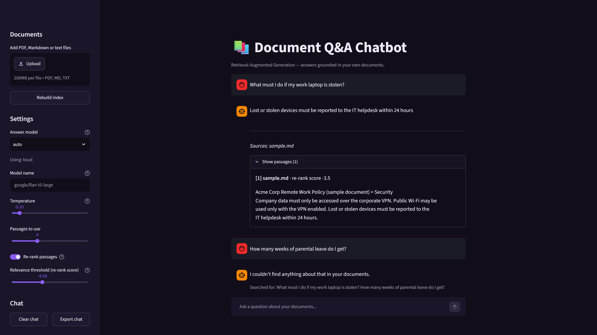
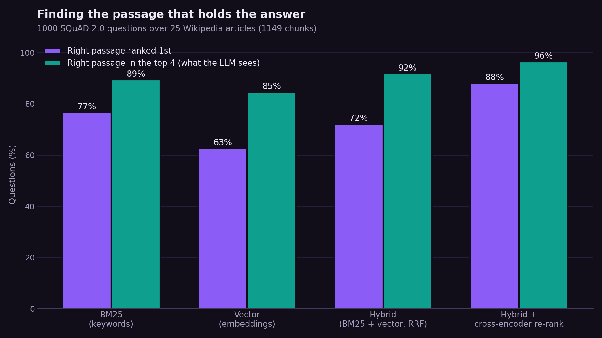
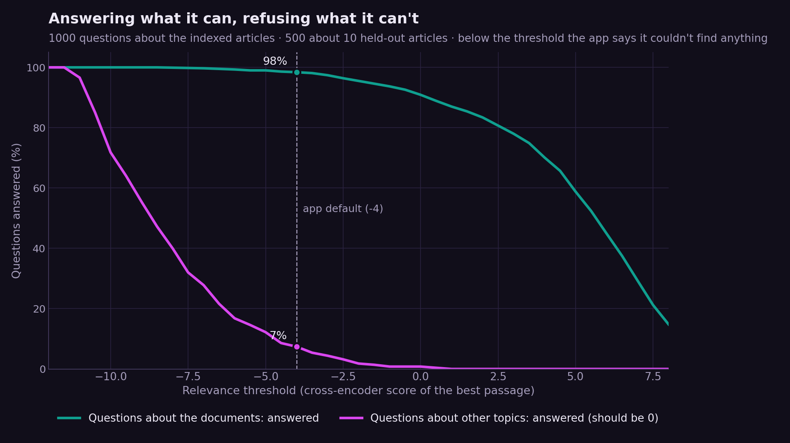
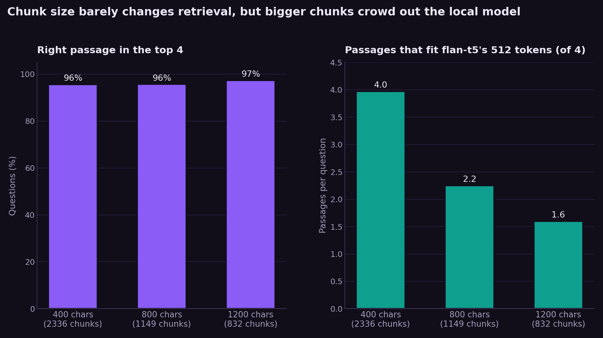

# 📚 Document Q&A Digital Assistant — Knowledge Management (RAG)

A digital assistant that answers questions about **your own documents**
(PDF, Markdown, or text). It uses **retrieval-augmented generation**: the app
first finds the most relevant passages in your files, then asks a language model
to answer using *only* those passages — so answers stay grounded and avoid
hallucination.

Built with Python, Sentence-Transformers, FAISS, a cross-encoder re-ranker and Streamlit.



*The free local model answers from the sample policy and shows the passage it used.
Asked about something the documents don't cover, it says so instead of guessing.*

---

## Why this project

General language models don't know your private manuals, policies, or notes.
RAG lets a chatbot answer questions about that material without retraining the
model — when the documents change, you just re-index them. This is the pattern
most companies use for internal Generative AI assistants.

---

## Results

Measured on **SQuAD 2.0** (Wikipedia paragraphs with crowd-written questions): 25 articles
are indexed as the documents (1,149 chunks), and 10 more are held out so their questions
are about topics the assistant has never seen. `python -m evaluation.run_eval` reproduces
every number and chart below.

### Finding the right passage



| Search method | Right passage ranked 1st | In the top 4 (what the LLM sees) |
|---|---|---|
| BM25 keyword search | 76.7% | 89.4% |
| Vector search (embeddings) | 62.7% | 84.7% |
| Hybrid (BM25 + vector, reciprocal rank fusion) | 72.2% | 91.8% |
| **Hybrid + cross-encoder re-ranking** (default) | **88.1%** | **96.5%** |

1,000 questions. Re-ranking turns a 72% first-place hit rate into 88%. Keyword search beats
embeddings here because SQuAD questions reuse the paragraph's own words; combining both is
better than either alone.

**The evaluation found a bug.** With re-ranking switched off, `retrieve()` re-sorted the
hybrid results by vector similarity, which silently threw away the BM25 half: "hybrid" scored
exactly the same as vector search (62.7% / 84.7%). The fix keeps the fused order and lifts it
to 72.2% / 91.8%; `tests/test_rag.py` now guards against it coming back.

### Refusing to guess



Below the relevance threshold the app answers *"I couldn't find anything about that in your
documents"* without calling the language model. At the default threshold (−4) it:

- **answers 98.4%** of 1,000 questions about the documents, with the right passage among
  the ones shown for 95.4%;
- **refuses 92.6%** of 500 questions about topics that are not in the documents.

Raising the threshold to −2 refuses 98% of off-topic questions but drops coverage to 95.5%.
Without re-ranking, the cosine-similarity threshold is far weaker: it still answered 38% of
the off-topic questions.

### Chunk size



Same 300 questions against indexes built with 400-, 800- and 1,200-character chunks:
retrieval barely changes (95.6–97.3% in the top 4), but the free local model (flan-t5,
512-token input) can read almost all four passages (3.97) of 400-character chunks, 2.25 of
the default 800-character ones and only 1.6 of 1,200-character ones. With a hosted model that has a long context, chunk size matters less.

### Answers from the free local model

| flan-t5-large, retrieval at the default settings | |
|---|---|
| 100 answerable questions: exact match / token F1 | 84% / 90.6% |
| Answerable questions wrongly refused | 3% |
| 50 unanswerable but on-topic questions: says it doesn't know | **24%** |
| Time per answer on a laptop CPU | ~6 s |

The weak spot is the last-but-one row. SQuAD 2.0's unanswerable questions are written about
the *same* paragraphs as real ones, so they pass the relevance threshold, and the small model
usually invents an answer instead of saying it doesn't know. The threshold protects against
off-topic questions (92.6% refused); catching on-topic ones depends on the answer model, which
is a reason to use Claude, OpenAI or Ollama for anything that matters.

### Bugs the evaluation found (and fixed)

1. **Hybrid search was really vector search** without re-ranking (see above).
2. **Memory leak in the local model:** every answer started a new thread, and PyTorch kept
   ~80 MB per thread. Over 150 answers the process grew past 20 GB and crashed. Answers now
   run on one reused worker thread, and memory stays flat (measured over 15 answers:
   +1.2 GB before, +0.25 GB after warm-up).
3. **A hang on model errors:** if the local model failed (e.g. out of memory), the error was
   swallowed on the worker thread and the app waited forever for text. The error is now
   raised to the caller.

Each fix has a regression test in `tests/test_rag.py`.

**Caveats.** The embedding model and flan-t5 were both trained partly on SQuAD, so the
absolute numbers are optimistic; the comparisons between methods and thresholds are the
useful part. The answer model is the small free one — Claude, OpenAI or Ollama give fuller
answers with citations.

---

## Setup

Requires Python 3.9+.

```bash
git clone https://github.com/Chandana18G/document-qa-digital-assistant.git
cd document-qa-digital-assistant
python -m venv .venv && source .venv/bin/activate   # Windows: .venv\Scripts\activate
pip install -r requirements.txt
```

The first run downloads the embedding and re-ranking models (~90 MB each) and,
if no API key or Ollama model is available, `flan-t5-large` (~3 GB).

## Usage

1. **Add documents.** Put your `.pdf`, `.md` or `.txt` files in `documents/`
   (subfolders are fine), or upload them from the web app's sidebar. A `sample.md`
   is included so you can try it right away.
2. **Build the index.** Re-run this whenever your documents change (the web app
   has a **Rebuild index** button that does the same):
   ```bash
   python ingest.py
   ```
3. **Ask questions** from the command line…
   ```bash
   python ask.py "How many days per week can I work remotely?"
   python ask.py          # interactive mode with follow-up questions; empty line quits
   ```
   …or in the web chat:
   ```bash
   streamlit run app.py   # opens http://localhost:8501
   ```

### Web app features

- **Streaming answers** with inline citations like `[1]` (Claude, OpenAI, Ollama).
- **Show passages** under each answer: the numbered passages the citations refer to,
  with their source file, PDF page number and relevance score.
- **Sidebar:** upload documents and rebuild the index; choose the answer model, model
  name, temperature, number of passages, re-ranking and relevance threshold; clear the
  chat or export it as Markdown.

### Configuration (environment variables)

**Answer model.** By default (`LLM_PROVIDER=auto`) the app uses the first one available:

1. **Claude** (`claude-opus-5-5`) if `ANTHROPIC_API_KEY` is set
2. **OpenAI** (`gpt-4o-mini`) if `OPENAI_API_KEY` is set
3. **Ollama** if it is running locally and `OLLAMA_MODEL` is pulled — free and much
   better than flan-t5: install [Ollama](https://ollama.com), then `ollama pull llama3.2`
4. **flan-t5-large**, a small local model that needs no setup (short answers only)

| Variable | Default | Purpose |
|----------|---------|---------|
| `LLM_PROVIDER` | `auto` | Force a provider: `anthropic`, `openai`, `ollama` or `local`. |
| `ANTHROPIC_API_KEY` | *(unset)* | Enables Claude. `ANTHROPIC_MODEL` overrides the model. |
| `OPENAI_API_KEY` | *(unset)* | Enables OpenAI. `OPENAI_MODEL` overrides the model. |
| `OLLAMA_MODEL` / `OLLAMA_HOST` | `llama3.2` / `http://localhost:11434` | Ollama model and server. |
| `RAG_LOCAL_MODEL` | `google/flan-t5-large` | Local fallback model; `google/flan-t5-base` needs less memory. |
| `RAG_RERANK` | `1` | `0` turns off cross-encoder re-ranking (faster, less accurate). |
| `RAG_MIN_RERANK_SCORE` | `-4.0` | Relevance cut-off with re-ranking on; below it the app answers "couldn't find". |
| `RAG_MIN_SIMILARITY` | `0.35` | Relevance cut-off (cosine similarity) with re-ranking off. |
| `RAG_TEMPERATURE` | `0.1` | Sampling temperature for OpenAI and Ollama. |
| `RAG_DOCS_DIR` | `./documents` | Folder to read documents from. |
| `RAG_INDEX_DIR` | `./index` | Folder where the vector index is stored. |

```bash
export ANTHROPIC_API_KEY="sk-ant-..."   # Windows PowerShell: $env:ANTHROPIC_API_KEY="sk-ant-..."
```

---

## How it works


```
                ┌─────────────────────────────────────────────┐
   documents/   │  1. INGEST   read PDF / MD / TXT files        │
  (your files)  │  2. CHUNK    split into ~800-char passages    │
        │       │  3. EMBED    turn each chunk into a vector     │
        ▼       │              (all-MiniLM-L6-v2)                │
   ┌─────────┐  │  4. STORE    save vectors in a FAISS index     │
   │ ingest  │──┼──────────────────────────────────────────────┘
   │  .py    │        writes -> index/
   └─────────┘
                ┌─────────────────────────────────────────────┐
   your         │  5. REWRITE a follow-up into a standalone     │
  question ────▶│     question using the chat history           │
                │  6. RETRIEVE vector (FAISS) + keyword (BM25)  │
                │     search, re-rank, drop irrelevant chunks   │
                │  7. GENERATE an answer from those chunks (LLM) │
                └─────────────────────────────────────────────┘
                                   │
                                   ▼
                       grounded answer + sources
```

- **Chunking:** follows the document structure — chunks stay within one Markdown
  section, break between paragraphs or sentences, and start with their section
  title (e.g. `Remote Work Policy > Equipment`).
- **Embedding model:** `all-MiniLM-L6-v2` (small, fast, free).
- **Hybrid search:** FAISS cosine similarity plus BM25 keyword search (good at exact
  terms, names and numbers), merged with reciprocal rank fusion.
- **Re-ranking:** the `ms-marco-MiniLM-L-6-v2` cross-encoder scores each candidate
  against the question; chunks below the relevance threshold are dropped, and if
  none are left the app says it couldn't find the answer instead of guessing.
- **Answer model:** Claude, OpenAI, Ollama or a local flan-t5 model — it runs with
  **zero cost** out of the box. Hosted models and Ollama cite the passages they used.
- **Sources:** each passage is labelled with its path inside `documents/` and, for
  PDFs, its page number (e.g. `hr/handbook.pdf p. 4`).

## Project structure

| File | What it does |
|------|--------------|
| `rag.py` | Core engine: read, chunk, embed, retrieve, generate. |
| `ingest.py` | Builds the FAISS vector index from `documents/`. |
| `ask.py` | Command-line question answering. |
| `app.py` | Streamlit web chat interface. |
| `documents/` | Put your source files here (includes `sample.md`). |
| `architecture.svg` | Pipeline diagram. |
| `.streamlit/config.toml` | Streamlit settings (file watcher off — restart after editing `app.py`). |
| `tests/` | Unit tests: `python -m pytest` (about a minute, no model downloads). |
| `evaluation/` | SQuAD 2.0 evaluation: `python -m evaluation.run_eval` (`--quick` skips the answer step). |
| `results/metrics.json`, `figures/` | Numbers and charts from the last evaluation run, plus the app screenshot. |
| `requirements.txt` | Python dependencies. |

---

## What I learned / demonstrated

- Building a full RAG pipeline end to end (chunking, embeddings, vector search,
  prompt construction, grounded generation).
- Using FAISS for fast semantic similarity search.
- Prompt engineering to constrain the model to the retrieved context and reduce
  hallucination.
- Designing the code so the LLM backend is swappable (cloud API or local model).
- **Measuring instead of assuming.** The evaluation showed which component earns its
  keep (the re-ranker), how to set the refusal threshold from data, and that the chunk size
  should depend on the answer model's context length. It also caught a bug that made the
  hybrid search no better than vector search — invisible in manual testing.

---

## Possible next steps

- Swap FAISS for a hosted vector database (e.g. Chroma, Pinecone).
- Deploy the Streamlit app to the cloud.

---

*Built by Chandana Gurusiddappa — M.Sc. Data Science & AI.
[GitHub](https://github.com/Chandana18G) · [LinkedIn](https://linkedin.com/in/chandana-gurusiddappa-785563223)*
